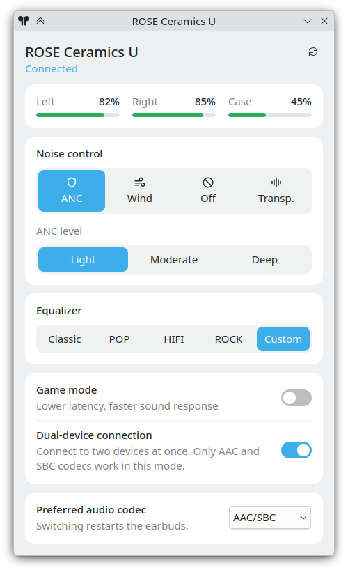

# rosebuds

Control ROSESELSA wireless earbuds on Linux. It includes a PySide6 tray app and a CLI tool.

Tested with **ROSE Ceramics Ultra**. Other models may work, but have not been tested.

It shows the battery status and can control noise cancellation, game mode, preferred audio codec, and a few other parameters.

Adding custom EQ presets, changing touch controls and some other functions are not yet implemented.

## Requirements

- Python 3.
- PySide6 for the GUI. The CLI has no third-party Python dependencies.
- Earbuds paired and connected to the Linux host.

## Installation

Clone the repository and run the install script:
```sh
./install.sh
```

After this, open rosebuds from the app menu. It should show an earbuds icon in the system tray.

To uninstall, run `./install.sh --uninstall`.

Or run the scripts directly without installing: `./rosebuds.py` for CLI or `./rosebuds-tray.py` for GUI.

## GUI

Right click the earbuds icon in the system tray for a quick access to main controls.

Left click will open a control panel with battery levels, noise control, and other settings.

Tested on KDE Plasma 6.

<p align="center">
  
</p>

## CLI

In the terminal, run `rosebuds` without arguments to print current status.

To list available commands, run `rosebuds -h`.

Some examples:

```sh
# Enable ANC
rosebuds anc on

# Set the ANC level
rosebuds anc-level deep

# Enable game mode
rosebuds game on
```

Leave out the value to show the current setting, e.g. `rosebuds anc-level` will print currently selected ANC level.

> [!IMPORTANT]
> The earbuds answer only one app at a time.
> If they don't respond, close ROSELINK app on Android or turn off Bluetooth on the phone.

The script discovers the earbuds by the same control service that is used by ROSELINK app.

## How it works

This tool talks to the earbuds over a vendor BLE service (`00fe`).

It opens the BLE (ATT) link on L2CAP channel 31 and writes commands to characteristic `00f1` and reads replies from `00f2`.

Each message is a list of settings, `ff <seq> <len> <id> <value>... <checksum> aa`.
The checksum is the low byte of the sum of all bytes before it.

| Setting | ID | Values |
|---|---|---|
| Noise control | `09` | `01` ANC, `02` off, `03` transparency, `04` wind |
| ANC level | `2c` | `01` light, `03` moderate, `05` deep |
| EQ preset | `2a` | `00` HIFI, `01` POP, `02` ROCK, `03` Classic, `04` custom |
| Game mode | `0e` | `00` off, `01` on |
| Dual-device connection | `32` | `00` off, `01` on. The earbuds restart to apply it |
| Preferred audio codec | `2b` | `00` AAC/SBC, `01` LDAC, `02` LHDC. The earbuds restart to apply it |
| Battery (read-only) | `0c` | 3 bytes: left, right, case. Low 7 bits = percent, high bit = charging, `ff` = unknown |

`custom` selects the last custom curve chosen in ROSELINK app.
The curves themselves are stored in the app, and sending them isn't supported yet.

## Disclaimer

This is an unofficial tool, not affiliated with ROSESELSA. Use it at your own risk.

The code is developed with AI assistance, reviewed and tested with my own earbuds.
